# Kubernetes Deployment and Recovery

This project demonstrates how I deployed, operated, updated, scaled, and recovered a containerized application using Kubernetes.

The main purpose was to build practical Kubernetes experience without turning the project into another large application or AWS infrastructure project. I reused my existing [System Health API](https://github.com/Tahir-Alakbarli/System-Health-API), kept the application unchanged, and focused on Kubernetes, Docker, Linux, YAML, and kubectl operations.

The environment runs locally in Ubuntu through WSL2. I used kind to create the Kubernetes cluster, which means the Kubernetes nodes run as Docker containers. This is a local learning environment, not Amazon EKS or a production Kubernetes platform.

## What I Built

The project includes:

- A local three-node Kubernetes cluster created with kind
- One control-plane node and two worker nodes
- A dedicated `kubernetes-recovery` namespace
- A Deployment running three application replicas
- A ClusterIP Service that sends traffic to the application Pods
- Application access through `kubectl port-forward`
- HTTP readiness and liveness probes using `/health`
- CPU and memory requests and limits
- Consistent labels and selectors
- ConfigMap-based application version configuration
- Kubernetes self-healing after manual Pod deletion
- Manual scaling from three replicas to five and back to three
- A rolling update from v1 to v2
- Rollout history and rollback to v1
- Complete removal of the namespace and kind cluster

## Tools Used

| Tool | Purpose |
|---|---|
| Kubernetes | Container orchestration and workload management |
| kind | Local Kubernetes cluster using Docker container nodes |
| kubectl | Cluster deployment, inspection, troubleshooting, scaling, and rollout management |
| Docker | Building the application image and running the kind nodes |
| Ubuntu on WSL2 | Linux command-line environment |
| YAML | Declarative Kubernetes and kind configuration |
| Flask and Gunicorn | Small reused application running inside the container |

## How the Components Work Together

| Component | Role in this project |
|---|---|
| kind cluster | Provides the local Kubernetes control plane and worker nodes |
| Namespace | Isolates all application resources under `kubernetes-recovery` |
| Deployment | Maintains the desired number of application Pods |
| ReplicaSet | Creates and replaces Pods for each Deployment revision |
| Pods | Run the System Health API container |
| ClusterIP Service | Provides one stable internal address and routes traffic to ready Pods |
| Labels and selectors | Connect the Deployment, Pods, and Service |
| ConfigMap | Provides the non-secret `APP_VERSION` value |
| Readiness probe | Prevents traffic from reaching a Pod until `/health` succeeds |
| Liveness probe | Restarts the container if `/health` repeatedly fails |
| Resource requests | Reserve the expected CPU and memory for scheduling |
| Resource limits | Restrict the maximum CPU and memory available to the container |
| Port forwarding | Makes the internal Service temporarily accessible from the local machine |

The Service selects Pods with the label:

```text
app=system-health-api
```

Traffic follows this path:

```text
Browser or curl
    -> kubectl port-forward on localhost:8000
    -> ClusterIP Service on port 80
    -> ready application Pod on port 8000
```


## Kubernetes Configuration

### kind-config.yaml

This file defines a three-node kind cluster:

- One control-plane node
- Two worker nodes
- Kubernetes node image version `v1.37.0`

The additional workers allowed the application Pods to run across more than one node while remaining completely local.

### namespace.yaml

The namespace manifest creates `kubernetes-recovery`.

I placed the ConfigMap, Deployment, Service, ReplicaSets, and Pods in this namespace instead of using the default namespace. This keeps the project resources grouped together and makes cleanup easier.

### configmap.yaml

The ConfigMap stores:

```text
APP_VERSION=v1
```

This is non-secret configuration, so it does not need a Kubernetes Secret. The Deployment imports it as an environment variable.

During the rolling update demonstration, I temporarily set `APP_VERSION=v2` directly on the Deployment. Rolling back restored the original Pod template and the ConfigMap-based v1 configuration.

### deployment.yaml

The Deployment defines the desired application state.

Important settings include:

- Three replicas
- Container image `system-health-api:v1`
- Container port `8000`
- Label `app=system-health-api`
- Readiness probe on `/health`
- Liveness probe on `/health`
- CPU request of `50m`
- Memory request of `64Mi`
- CPU limit of `250m`
- Memory limit of `256Mi`
- Rolling update strategy
- `maxUnavailable: 0`
- `maxSurge: 1`

The Deployment continuously compares the desired state with the actual state. If a Pod disappears, the Deployment's ReplicaSet creates a replacement.

The rolling update settings allow one additional Pod to be created while preventing Kubernetes from intentionally making an existing ready replica unavailable during the update.

### service.yaml

The Service is a ClusterIP Service named `system-health-api-service`.

It exposes:

```text
Service port: 80
Target Pod port: 8000
```

The Service uses `app=system-health-api` as its selector. This matches the Pod label in the Deployment and allows the Service to discover the correct Pods.

ClusterIP is internal to the cluster. I used `kubectl port-forward` instead of adding an Ingress, LoadBalancer, or cloud infrastructure.

## Accessing the Application

The Service exposes port 80, while the application container listens on port 8000. The correct port-forward command is:

```bash
kubectl port-forward service/system-health-api-service 8000:80 --namespace kubernetes-recovery
```

The first port is the local port. The second port is the Service port.

The endpoints are then available at:

```text
http://localhost:8000/
http://localhost:8000/health
http://localhost:8000/version
```

## Verifying the Deployment

Used verification and troubleshooting commands include:

```bash
kubectl get pods --namespace kubernetes-recovery -o wide
kubectl get deployment,service --namespace kubernetes-recovery
kubectl describe deployment system-health-api --namespace kubernetes-recovery
kubectl describe service system-health-api-service --namespace kubernetes-recovery
kubectl logs --selector app=system-health-api --namespace kubernetes-recovery --prefix --tail=50
kubectl rollout status deployment/system-health-api --namespace kubernetes-recovery
kubectl rollout history deployment/system-health-api --namespace kubernetes-recovery
```

The Deployment description confirms the probes, resource settings, image, labels, selectors, rollout strategy, and replica status.

The Service description confirms the ClusterIP type, Service port, target port, selector, and Pod endpoints.

## Self-Healing Demonstration

I first listed the three running Pods:

```bash
kubectl get pods --namespace kubernetes-recovery
```

I copied one Pod name and deleted only that Pod:

```bash
kubectl delete pod POD_NAME --namespace kubernetes-recovery
```

I then watched the Pod list:

```bash
kubectl get pods --namespace kubernetes-recovery --watch
```

The deleted Pod disappeared, and the Deployment's ReplicaSet automatically created a replacement with a new name. The application returned to three ready replicas without recreating the Deployment manually.

After the replacement reached `1/1 Running`, I pressed `Ctrl+C` to stop watching.

## Manual Scaling Demonstration

I increased the replica count from three to five:

```bash
kubectl scale deployment system-health-api --replicas=5 --namespace kubernetes-recovery
kubectl get pods --namespace kubernetes-recovery --watch
```

After all five Pods reached `1/1 Running`, I stopped the watch with `Ctrl+C`.

I then returned the Deployment to its original size:

```bash
kubectl scale deployment system-health-api --replicas=3 --namespace kubernetes-recovery
kubectl rollout status deployment/system-health-api --namespace kubernetes-recovery --timeout=120s
```

Scaling changed the live Deployment without requiring changes to the application code.

## Rolling Update Demonstration

The project focused on Kubernetes behavior rather than application development. I created a v2 image tag from the already tested image and changed `APP_VERSION` so the running version could be verified through the API.

Create and load the v2 tag:

```bash
docker tag system-health-api:v1 system-health-api:v2
kind load docker-image system-health-api:v2 --name kubernetes-recovery
```

I paused the Deployment before changing the image and environment variable. This grouped both Pod template changes into one rollout revision:

```bash
kubectl rollout pause deployment/system-health-api --namespace kubernetes-recovery
kubectl set image deployment/system-health-api system-health-api=system-health-api:v2 --namespace kubernetes-recovery
kubectl set env deployment/system-health-api APP_VERSION=v2 --namespace kubernetes-recovery
kubectl annotate deployment/system-health-api kubernetes.io/change-cause="Rolling update to v2" --namespace kubernetes-recovery --overwrite
kubectl rollout resume deployment/system-health-api --namespace kubernetes-recovery
```

I watched the rollout complete:

```bash
kubectl rollout status deployment/system-health-api --namespace kubernetes-recovery --timeout=120s
kubectl get pods --namespace kubernetes-recovery -o wide
kubectl get replicasets --namespace kubernetes-recovery
```

Kubernetes gradually created the new Pods and terminated the old Pods. The old ReplicaSet remained in the rollout history with zero active replicas.

After the rollout, `/version` returned:

```json
{"version":"v2"}
```

## Rollout History and Rollback

I viewed the Deployment revisions:

```bash
kubectl rollout history deployment/system-health-api --namespace kubernetes-recovery
```

The history showed:

```text
Revision 1: Initial deployment of v1
Revision 2: Rolling update to v2
```

I rolled back to the previous working revision:

```bash
kubectl rollout undo deployment/system-health-api --namespace kubernetes-recovery
kubectl rollout status deployment/system-health-api --namespace kubernetes-recovery --timeout=120s
kubectl get pods --namespace kubernetes-recovery
kubectl get deployment system-health-api --namespace kubernetes-recovery -o wide
```

The Deployment returned to `system-health-api:v1`, three replacement Pods became ready, and `/version` returned:

```json
{"version":"v1"}
```

Kubernetes recorded the restored v1 Pod template as the newest revision. The final history therefore showed revision 2 for v2 and revision 3 for the restored v1 configuration.

## Project Evidence

### Local kind cluster and three nodes

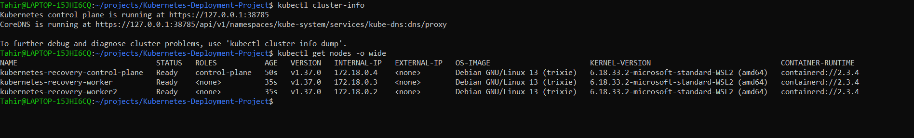

### Initial Deployment, Pods, and Service

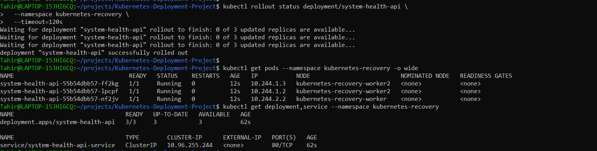

### Application health through port forwarding

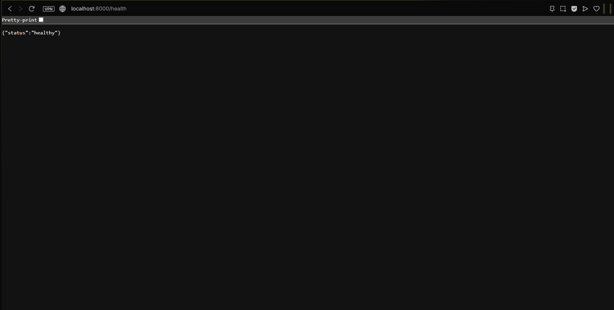

### Probes, resources, ConfigMap, and rollout strategy

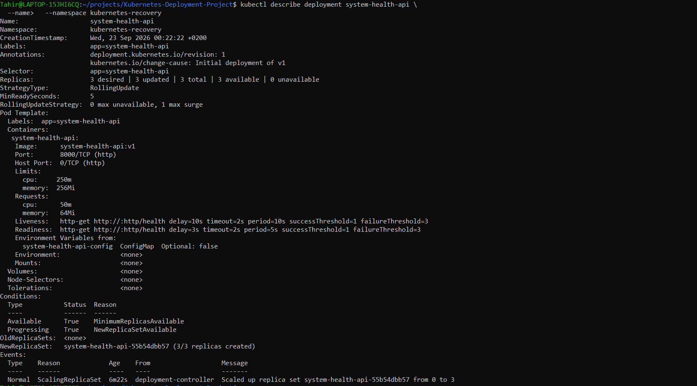

### Pod deletion and automatic replacement

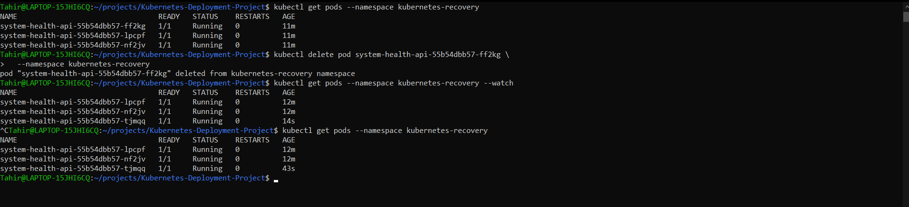

### Five ready replicas after manual scaling

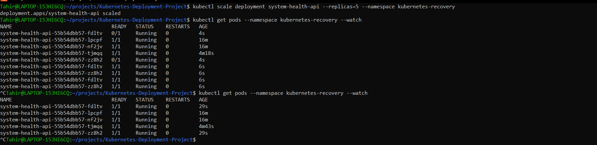

### Completed rolling update

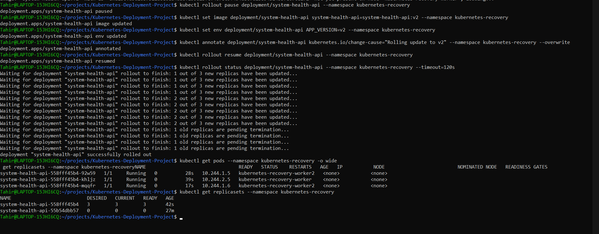

### Version 2 after the update


### Rollout history

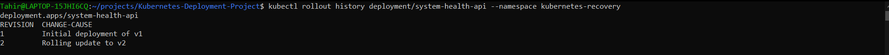

### Successful rollback to the v1 image

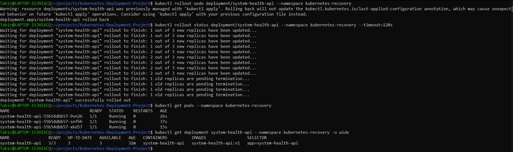

### Version 1 after rollback

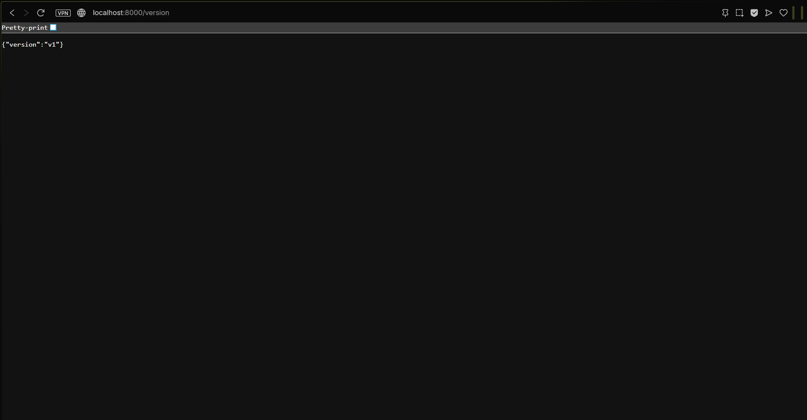

### Final resource status

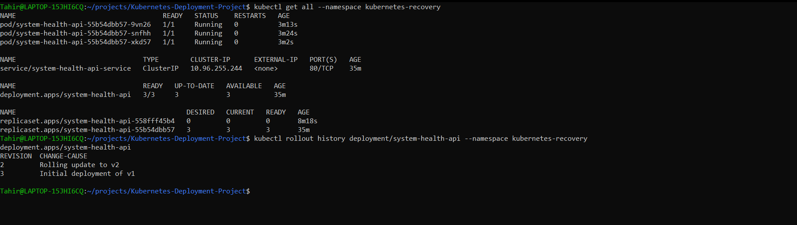

## Problems Encountered and Fixes

### Docker was unavailable inside WSL2

### kubectl and kind were missing

Neither `kubectl` nor `kind` was initially installed. A system-wide installation could not be completed through sudo, so I downloaded the official Linux binaries and installed them under:

```text
~/.local/bin
```

I then added that directory to `PATH` and confirmed both versions.

### Port forwarding used the wrong Service port

The first port-forward attempt used:

```bash
kubectl port-forward service/system-health-api-service 8000:8000 --namespace kubernetes-recovery
```

Kubernetes rejected it because the Service does not expose port 8000. Port 8000 is the Pod target port, while the Service exposes port 80.

The corrected command was:

```bash
kubectl port-forward service/system-health-api-service 8000:80 --namespace kubernetes-recovery
```

## Cleanup

After saving the screenshots, I deleted the application namespace:

```bash
kubectl delete namespace kubernetes-recovery
```

I then deleted the kind cluster:

```bash
kind delete cluster --name kubernetes-recovery
kind get clusters
```

Deleting the kind cluster removed its control-plane and worker containers.

The v2 tag was no longer needed:

```bash
docker image rm system-health-api:v2
```

I retained `system-health-api:v1` and the kind node image for possible reuse in the next project.

I did not use `docker system prune` because that could remove unrelated Docker data.

## Limitations

- This is a local kind environment, not Amazon EKS or a production cluster.
- kind runs the Kubernetes nodes as Docker containers.
- The ClusterIP Service is accessed through temporary port forwarding.
- There is no Ingress, external load balancer, persistent storage, or database.
- Version 2 reused the tested application image contents and changed the image tag and version environment variable to demonstrate the Kubernetes rollout process.
- Scaling and rollout operations are manual.
- The project does not include automatic scaling, monitoring, or production security controls.

These limitations were intentional because the project focuses specifically on core Kubernetes deployment and recovery skills.

## Possible Improvements

Possible future improvements include:

- Using a real application code change for the second image version
- Adding automated manifest validation
- Automating image publication and Kubernetes delivery through CI/CD
- Testing the same deployment process on a managed Kubernetes service in a separate project
- Integration with other services such as AWS, Terraform and so on.
## Sources

The more advanced Kubernetes configuration was based on the following official documentation:

- [kind documentation](https://kind.sigs.k8s.io/)
- [kind Quick Start and loading local images](https://kind.sigs.k8s.io/docs/user/quick-start/)
- [kind cluster configuration](https://kind.sigs.k8s.io/docs/user/configuration/)
- [Using kind with WSL2](https://kind.sigs.k8s.io/docs/user/using-wsl2/)
- [Install kubectl on Linux](https://kubernetes.io/docs/tasks/tools/install-kubectl-linux/)
- [Kubernetes Deployments](https://kubernetes.io/docs/concepts/workloads/controllers/deployment/)
- [Labels and selectors](https://kubernetes.io/docs/concepts/overview/working-with-objects/labels/)
